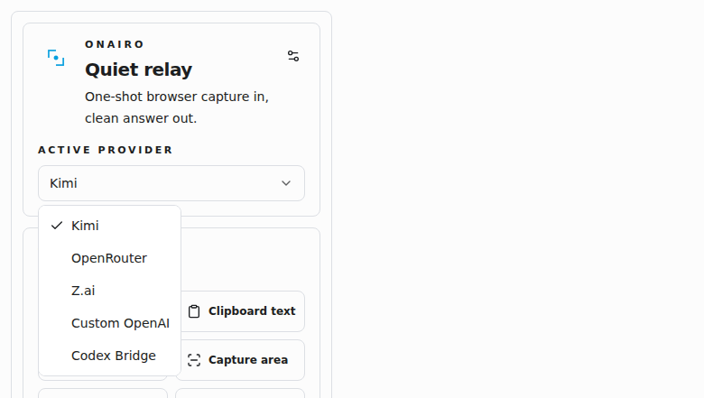

<div align="center">
  

  <h1>Onairo</h1>

  <p><strong>Quiet browser relay for one-shot AI workflows</strong></p>

  <p>Capture · Route · Answer · Copy · Type · Overlay</p>

  <p>
    
    
    
    
    
  </p>
</div>

<p align="center">
  
</p>

## overview

Onairo is a Chromium extension for quiet one-shot AI workflows in the browser.

It is built around a simple loop:

- grab something from the browser
- send it to an AI provider fast
- get the answer back with as little friction as possible

Onairo keeps that flow minimal, multi-provider, and fast to operate.

## what you get

- selected text, clipboard text, clipboard image, right-click image, and A-to-B capture input flows
- hosted providers:
  - Kimi
  - OpenRouter
  - Z.ai
  - custom OpenAI-compatible endpoints
- optional local provider:
  - Codex CLI through a Chromium native-messaging bridge
- output actions for copy, paste, simulated typing, tooltip display, and top-right answer overlay
- minimal popup and settings UI built with React, TypeScript, Tailwind, and shadcn/ui
- live settings previews for selection styling, output shape, and Codex bridge execution

## screenshots

<p align="center">
  
</p>

## providers

Hosted providers share the same OpenAI-style request boundary.

- `kimi`
- `openrouter`
- `zai`
- `custom`

`codex` is separate and uses the local native host under [native-host](native-host).

## codex bridge

The native host lives in [native-host/onairo-codex-host.mjs](native-host/onairo-codex-host.mjs).

What it does:

- exposes a native-messaging host for Chromium
- runs `codex exec` in non-interactive mode
- returns the final stdout message back to the extension
- forwards configured model label, reasoning effort, timeout, and optional working directory

Install notes live in [native-host/README.md](native-host/README.md).

## install

### load the extension

```bash
pnpm install
pnpm build
```

Then:

1. open `chrome://extensions`
2. enable Developer mode
3. click `Load unpacked`
4. select the `dist/` directory

### enable the codex bridge

After the extension is loaded, copy the extension ID and run:

```bash
node native-host/install-host.mjs --extension-id <your-extension-id>
```

Then open Onairo settings and enable `Codex Bridge`.

## development

```bash
pnpm install
pnpm build
pnpm test
```

The production extension bundle is generated into `dist/`.

## notes

- this repo intentionally keeps one canonical implementation path
- the Codex bridge is text-only
- the extension requests only the provider/network permissions it actually needs
