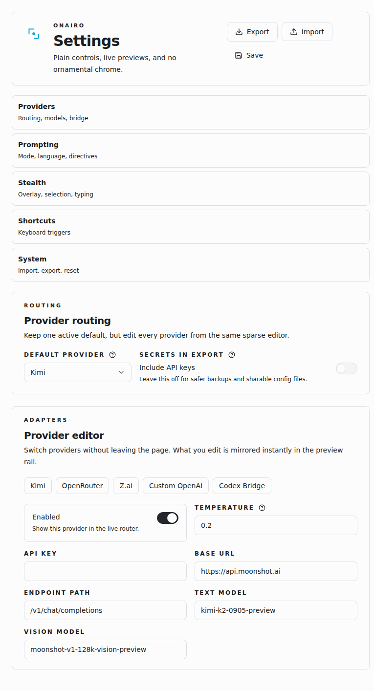

<div align="center">
  

  <h1>onairo</h1>

  <p><strong>quiet browser relay for one-shot AI workflows</strong></p>

  <p>
    
    
    
    
    
  </p>
</div>

<p align="center">
  
</p>

## overview

Onairo is a Chromium extension for quiet one-shot AI workflows in the browser.

It is built around a simple loop:

- grab something from the browser
- send it to an AI provider fast
- get the answer back with as little friction as possible

Onairo keeps that flow minimal, multi-provider, and fast to operate.

## features

- selected text, clipboard text, clipboard image, right-click image, and A-to-B capture input flows
- hosted providers:
  - Kimi
  - OpenRouter
  - Z.ai
  - custom OpenAI-compatible endpoints
- optional local provider:
  - Codex CLI through a Chromium native-messaging bridge
- output actions for copy, paste, simulated typing, tooltip display, and top-right answer overlay
- minimal popup and settings UI built with React, TypeScript, Tailwind, and shadcn/ui
- live settings previews for selection styling, output shape, and Codex bridge execution
- automatic language detection (English and Spanish)
- configurable response modes: technical, student, single answer, short answer, auto
- keyboard-driven workflow with fully configurable hotkeys

## screenshots

<p align="center">
  
</p>

## hotkeys

| Action | Default | Configurable |
|--------|---------|:------------:|
| Input selected text | `Ctrl+Shift+T` | ✓ |
| Input clipboard text | `Ctrl+Shift+L` | ✓ |
| Input image | `Ctrl+Shift+I` | ✓ |
| Capture area (A→B) | `Ctrl+Shift+C` | ✓ |
| Paste last output | `Ctrl+Shift+P` | ✓ |
| Type last output | `Ctrl+Shift+K` | ✓ |
| Copy last output | `Ctrl+Shift+Y` | ✓ |
| Show output tooltip | `Ctrl+Shift+U` | ✓ |
| Show answer overlay | `Ctrl+Shift+A` | ✓ |

All hotkeys can be changed in the Onairo settings page.

## providers

Hosted providers share the same OpenAI-style request boundary.

| Provider | Text | Vision | Continuation |
|----------|:----:|:------:|:------------:|
| Kimi | ✓ | ✓ | ✓ |
| OpenRouter | ✓ | ✓ | ✓ |
| Z.ai | ✓ | ✓ | ✓ |
| Custom OpenAI | ✓ | ✓ | ✓ |
| Codex Bridge | ✓ | — | ✓ |

`codex` is separate and uses the local native host under [native-host](native-host).

## codex bridge

The native host lives in [native-host/onairo-codex-host.mjs](native-host/onairo-codex-host.mjs).

What it does:

- exposes a native-messaging host for Chromium
- runs `codex exec` in non-interactive mode
- returns the final stdout message back to the extension
- forwards configured model label, reasoning effort, timeout, and optional working directory

Install notes live in [native-host/README.md](native-host/README.md).

## architecture

```
src/
├── background/       Service worker — message routing, context menus, run orchestration
├── content/          Content script — DOM injection, hotkeys, capture overlay, toast/tooltip
├── popup/            Popup UI — provider selector, quick actions, output cache, follow-up
├── options/          Settings UI — full configuration page
├── features/
│   ├── providers/    Provider catalog, API client, Codex bridge client
│   ├── runs/         Run engine, prompt builder, output post-processing
│   └── settings/     Settings schema, storage layer, defaults
├── components/ui/    shadcn/ui primitives
├── types/            Shared TypeScript types
└── lib/              Utility functions
native-host/          Codex native-messaging host (Node.js)
```

## install

### load the extension

```bash
pnpm install
pnpm build
```

Then:

1. open `chrome://extensions`
2. enable Developer mode
3. click `Load unpacked`
4. select the `dist/` directory

### enable the codex bridge

After the extension is loaded, copy the extension ID and run:

```bash
node native-host/install-host.mjs --extension-id <your-extension-id>
```

Then open Onairo settings and enable `Codex Bridge`.

## development

```bash
pnpm install
pnpm dev        # Start Vite dev server with HMR
pnpm build      # Type-check and production build
pnpm test       # Run vitest
pnpm lint       # Run ESLint
```

The production extension bundle is generated into `dist/`.

## security notes

- API keys are stored locally in `chrome.storage.local` and never leave your browser
- The extension requests only the provider/network permissions it actually needs
- The Codex bridge is text-only and runs locally

## license

[MIT](LICENSE)

## notes

- this repo intentionally keeps one canonical implementation path
- the Codex bridge is text-only
- the extension requests only the provider/network permissions it actually needs
